# Slick Developer's Guide

## Introduction

`Slick` is an [R package](https://github.com/Blue-Matter/Slick) designed
for visualizing and exploring results of a Management Strategy
Evaluation (MSE).

`Slick` allows MSE developers and analysts to prepare their MSE results
in a standardized data structure, easily generate publication quality
figures and tables, and present and explore the MSE results in an
interactive application.

This document is a guide for analysts who wish to use `Slick` to
summarize and present their MSE results.

### Installing Slick

`Slick` can be installed from CRAN:

``` r
install.packages('Slick')
```

The development version can be installed from Github:

``` r
# install.packages('pak')
pak::pkg_install('blue-matter/Slick')
library(Slick)
```

### Reporting Issues and Bugs

Please use the [Issues](https://github.com/Blue-Matter/Slick/issues)
feature in the GitHub repository to report issues or bugs. Be sure to
include a reproducible example so the issue can be recreated for
debugging. [Pull Requests](https://github.com/Blue-Matter/Slick/pulls)
are also welcome.

### Acknowledgements

`Slick` was developed by [Blue Matter
Science](https://www.bluematterscience.com) and designed and
commissioned by [The Ocean Foundation’s](https://oceanfdn.org/)
International Fisheries Conservation Project and
[https://harveststrategies.org/](https://www.harveststrategies.org),
with support from [The Pew Charitable Trusts](https://www.pewtrusts.org)
and the [Common Oceans Tuna Fisheries
Project](https://www.fao.org/in-action/commonoceans/what-we-do/tuna-fisheries/en/)
which is funded by
[GEF](https://www.thegef.org/what-we-do/topics/areas-beyond-national-jurisdiction)
and implemented by the
[FAO](https://www.fao.org/in-action/commonoceans/en/).

The prototype figure designs were developed by [5W
Infographics](https://www.5wgraphics.com/).

`Slick` is under going further development. All feedback is welcome.
Please contact [Shana
Miller](mailto:smiller@oceanfdn.org?&subject=Slick%20Development) with
any comments or suggestions for further development.

## The Slick Object

To use `Slick`, MSE results must be compiled into a [*Slick
Object*](https://slick.bluematterscience.com/reference/Slick-class.md).
The object is designed to be compatible with results from any MSE
framework.

The *Slick Object* contains all of the information shown in the plots
and tables, as well as metadata information such as title, introduction,
and author details.

The contents of the Slick Object can be grouped into the following
categories:

1.  **Metadata**: information including the title, introduction, and
    author details
2.  **MPs**: details of the *Management Procedures*
3.  **OMs**: factors, levels, and other information relating to the
    *Operating Models*
4.  **Plots**: details and values of the *Performance Indicators* for
    the Slick Plots

## The Slick Plots

A Slick Object can include the following plots:

1.  **Time Series**: Plots the time series of a user-specified variable
    (e.g., yield, biomass) during the historical period and the
    projection period for each management procedure.
2.  **Boxplot**: Displays the minimum, first quartile, median, third
    quartile, and maximum from a set of results. Includes an option to
    display the data as a violin plot.
3.  **Kobe**: Compares the performance of MPs with respect to biomass
    (on the x-axis) and fishing mortality (on the y-axis). Includes an
    option to display the data as a Kobe Time plot, which shows the
    percentage of runs that fall in each of the Kobe quadrants in each
    projection year.
4.  **Quilt**: A table of performance indicators for each management
    procedure, with colored shading to indicate better/worse
    performance.
5.  **Spider**: Shows results for three or more performance indicators,
    each represented on an axis starting from the same center point.
    Sometimes also called a Radar plot.
6.  **Tradeoff**: Scatter plot comparing two performance indicators.

A valid Slick Object must include at least one Slick Plot.

## The Slick App

`Slick` can be used to rapidly create standardized plots and tables of
MSE results directly from the R console. See the sections below for
examples.

The plots and tables can also be viewed in the *Slick App*, an
interactive application developed with [Shiny](https://shiny.posit.co/).
The Slick App allows users to upload their data and customize the plots
by filtering by management procedures, operating models, and performance
indicators.

### Running the App Locally

The App can be launched directly from the R console with:

``` r
App()
```

This command will open the *Slick App* in the web browser on your
machine. From there you can either select one of the case studies
included in `Slick`, or load your `Slick` object (see sections below for
creating a `Slick` object) by uploading your *.slick* file.

Alternatively, if you have a `Slick` object loaded in the R console, you
can launch the App directly with the object by using a named argument in
the `App` call:

``` r
App(slick=MySlickObject)
```

where `MySlickObject` is an object of class `Slick`.

### Using the Online App

The App is also hosted
[online](https://shiny.bluematterscience.com/app/slick).

The online App is publicly accessible and can be used for presenting and
examining MSE results to stakeholders and decision-makers.

Analysts can either share their [Slick Object](#slickobject) with their
audience directly for them to upload into the App, or analysts can
upload their Slick Object to the [Slick Object
Library](#slick-object-library), where it will be added to the list of
Slick Objects that can be loaded directly within the App.

## Example MSEs

In order to populate the example Slick Object, we need to define some
operating models (OMs), and some management procedures (MPs), and
generate some quantitative values for the *Performance Indicators*
relating to each [Slick Plot](#slickplot).

To do this, we will be using the [openMSE](https://openmse.com/)
platform to create example MSE objects for a set of MPs and several
different OMs.

To reproduce this example, you will need to install the `openMSE`
package and run the code in the following sub-sections.

Alternatively, you can follow the code in the plotting sections below
and replace the example OMs, MPs, and Performance Indicator values shown
here with those from your own MSE.

### Install openMSE

``` r
pak::pkg_install('blue-matter/openMSE')
```

``` r
library(openMSE)
```

### Generate Operating Models

In this example, we are creating three operating models:

1.  **Base**: Base Case model for an (entirely fictional) Albacore
    fishery
2.  **Low M**: A robustness model where natural mortality (*M*) is 25%
    lower than the Base Case model
3.  **High M**: A robustness model were *M* is 33% higher than the Base
    Case model

``` r
nsim <- 12
OM_Base <- new('OM', Albacore, Generic_IncE, Generic_Obs, nsim=nsim)
OM_Base@D <- c(0.3,0.4)

OM_LowM <- OM_HighM <- OM_Base
OM_LowM@M <- OM_Base@M * 0.75
OM_HighM@M <- OM_Base@M * 1.3333
```

Each OM has 12 individual simulations (`nsim=12`). The OMs include
uncertainty in the life-history parameters and the depletion at the end
of the historical period (`D=c(0.3,0.4)`).

### Specify Management Procedures

We are using four example management procedures from the `DLMtool`
package:

1.  **AvC**: the TAC is fixed for all years to the average catch from
    the historical period
2.  **Itarget1**: the TAC is iteratively adjusted to reach a target CPUE
3.  **DD**: A simple delay-difference assessment model is used to
    estimate current biomass $(B)$ and $U_{MSY}$, and
    $\text{TAC} = U_{MSY}B$
4.  **SPmod**: TAC is incrementally adjusted based on the apparent trend
    in surplus production.

``` r
MPs <- c('AvC', 'Itarget1', 'DD', 'SPmod')
```

These MPs are only being used here as examples, so the details don’t
really matter. But if you’re interested you can see the [`DLMtool` help
documentation](https://dlmtool.openmse.com/reference/index.html) for
more details on each MP.

### Run Simulations

The `runMSE` function is used to spool up the historical fishery
dynamics and run the closed-loop simulation testing of the four MPs for
each of the three OMS:

``` r
MSE_Base <- runMSE(OM_Base, MPs=MPs, silent = TRUE)
MSE_LowM <- runMSE(OM_LowM, MPs=MPs, silent = TRUE)
MSE_HighM <- runMSE(OM_HighM, MPs=MPs, silent = TRUE)


detach("package:openMSE", unload = TRUE)
detach("package:SAMtool", unload = TRUE)
detach("package:DLMtool", unload = TRUE)
detach("package:MSEtool", unload = TRUE)

library(Slick)
```

In the sections below, these MSE objects will be used to calculate the
performance indicators for each [Slick Plot](#slickplot).

## Creating a Slick Object

To create a Slick Object, simply use the
[`Slick()`](https://slick.bluematterscience.com/reference/Slick-class.md)
function:

``` r
slick <- Slick()
```

`slick` is an S4 object of class `Slick`:

``` r
class(slick)
#> [1] "Slick"
#> attr(,"package")
#> [1] "Slick"
```

The slots in class `Slick` objects correspond to information such as the
title, subtitle, and author of the `Slick` object, the operating models
(OMs), and management procedures (MPs) included in the `Slick` object,
and the details corresponding to each of the [Slick Plots](#slickplot):

``` r
slotNames('Slick')
#>  [1] "Title"        "Subtitle"     "Date"         "Author"       "Email"       
#>  [6] "Institution"  "Introduction" "MPs"          "OMs"          "Boxplot"     
#> [11] "Kobe"         "Quilt"        "Spider"       "Timeseries"   "Tradeoff"
```

Each slot can be accessed and assigned using a function corresponding to
the slot name; e.g.:

``` r
Date(slick)
#> [1] "2026-02-27"
Date(slick) <- Sys.Date()
```

The sections below provide examples for populating the `Slick` object.

## Metadata

The `Title`, `Subtitle`, `Date`, `Author`, `Email`, and `Institution`
functions are used to populate the corresponding information in the
Slick Object.

These metadata are optional, but are useful when presenting the Slick
results in the [App](#app):

``` r
Title(slick) <- 'An Example Slick Object'
Subtitle(slick) <- "For Testing and Demonstration Purposes"
Date(slick) <- Sys.Date()
Author(slick) <- 'Adrian Hordyk'
Email(slick) <-  "[adrian@bluematterscience.com](mailto:adrian@bluematterscience.com)"
Institution(slick) <- "[Blue Matter Science](bluematterscience.com)"
```

The same functions are used to return the information stored in the
Slick Object:

``` r
Title(slick)
#> [1] "An Example Slick Object"
Subtitle(slick)
#> [1] "For Testing and Demonstration Purposes"
Date(slick)
#> [1] "2026-02-27"
Author(slick)
#> [1] "Adrian Hordyk"
Email(slick)
#> [1] "[adrian@bluematterscience.com](mailto:adrian@bluematterscience.com)"
Institution(slick)
#> [1] "[Blue Matter Science](bluematterscience.com)"
```

### Markdown

With the exception of `Date`, Markdown can be used to include links,
text styling, etc, for any of the text in the Slick Object. For example:

``` r
Introduction(slick) <- "

This *example* Slick Object has been designed to demonstrate the main features of **Slick**.

The code used to create this object is available in the [Slick Developer's Guide](https://slick.bluematterscience.com/articles/DevelopersGuide.html).

The information shown here is for demonstration purposes only.

"
```

The Markdown will be automatically converted to HTML in the App. Use the
`markdown=TRUE` argument to print the HTML code in the console (in this
document the HTML text is rendered directly between the horizontal
lines):

``` r
Introduction(slick, markdown = TRUE)
```

------------------------------------------------------------------------

This *example* Slick Object has been designed to demonstrate the main
features of **Slick**.

The code used to create this object is available in the [Slick
Developer's
Guide](https://slick.bluematterscience.com/articles/DevelopersGuide.html).

The information shown here is for demonstration purposes only.

------------------------------------------------------------------------

### Multiple Authors

`Author` should be a character vector with an element for each author:

``` r
Author(slick) <- c('A. Author', 'B. Author')
```

`Email`, and `Institution` must be character vectors of the same length
as `Author`:

``` r
Email(slick) <- c('[a.author@email.com](mailto:a.author@email.com)',
                  '[b.author@email.com](mailto:b.author@email.com)')


Institution(slick) <- c('A Institution', 'B Institution')
```

### Multi-Language Support

`Title`, `Subtitle`, and `Introduction` support multiple languages. Four
languages are supported:

- `en`: English
- `es`: Spanish
- `fr`: French
- `pt`: Portuguese

Multiple languages can included by providing a named list:

``` r
Title(slick) <- list(en='An Example Slick Object',
                     es='Un ejemplo de un objeto Slick',
                     fr="Un exemple d'objet Slick",
                     pt="Um exemplo de objeto Slick")
```

``` r
Title(slick)
#> [1] "An Example Slick Object"

Title(slick, 'es')
#> [1] "Un ejemplo de un objeto Slick"

Title(slick, 'fr')
#> [1] "Un exemple d'objet Slick"

Title(slick, 'pt')
#> [1] "Um exemplo de objeto Slick"
```

Most text throughout the Slick Object supports both Markdown and
multiple languages.

The [App](#app) has a dropdown menu that allows users to select their
preferred language.

## MPs Object

The [MPs
Object](https://slick.bluematterscience.com/reference/MPs-methods.md)
contains the codes, labels, and descriptions of the management
procedures (MPs) included in the Slick Object, as well as other options
such as the colors to use in the plots, and preset buttons that will
appear in the App.

All Slick Objects must have a completed MPs Object.

The easiest way to build a Slick Object is to create and populate the
sub-components and then add them to the Slick Object.

### Code, Label, and Description

`Code`, and `Label` are both required, as they are used in the plots and
tables, while `Description` is optional.

In this example, there are 4 MPs:

``` r
mps <- MPs()
Code(mps) <- c('AvC', 'Itarget1', 'DD', 'SPmod')
Label(mps) <- c('Average Catch',
                'Index Target',
                'Delay Difference',
                'Surplus Production')

Description(mps) <- c('TAC is fixed for all years to the average catch from the historical period',
                      'TAC is iteratively adjusted to reach a target CPUE',
                      'Delay-difference assessment model used to estimate current biomass $(B)$ and $U_{MSY}$, and $\text{TAC}= U_{MSY}B$',
                      'TAC is incrementally adjusted based on the apparent trend in surplus production')
```

This could have also been done as:

``` r
mps <- MPs(Code=c('AvC', 'Itarget1', 'DD', 'SPmod'),
           Label=c('Average Catch',
                   'Index Target',
                   'Delay Difference',
                   'Surplus Production'),
           Description = c('TAC is fixed for all years to the average catch from the historical period',
                           'TAC is iteratively adjusted to reach a target CPUE',
                           'Delay-difference assessment model used to estimate current biomass $(B)$ and $U_{MSY}$, and $\text{TAC}= U_{MSY}B$',
                           'TAC is incrementally adjusted based on the apparent trend in surplus production'))
```

Or using the `Metadata` function:

``` r
Metadata(mps) <- data.frame(
  Code=c('AvC', 'Itarget1', 'DD', 'SPmod'),
  Label=c('Average Catch',
          'Index Target',
          'Delay Difference',
          'Surplus Production'),
  Description=c('TAC is fixed for all years to the average catch from the historical period',
                'TAC is iteratively adjusted to reach a target CPUE',
                'Delay-difference assessment model used to estimate current biomass $(B)$ and $U_{MSY}$, and $\text{TAC}= U_{MSY}B$',
                'TAC is incrementally adjusted based on the apparent trend in surplus production')
)

Metadata(mps)
#>       Code              Label
#> 1      AvC      Average Catch
#> 2 Itarget1       Index Target
#> 3       DD   Delay Difference
#> 4    SPmod Surplus Production
#>                                                                                                          Description
#> 1                                         TAC is fixed for all years to the average catch from the historical period
#> 2                                                                 TAC is iteratively adjusted to reach a target CPUE
#> 3 Delay-difference assessment model used to estimate current biomass $(B)$ and $U_{MSY}$, and $\text{TAC}= U_{MSY}B$
#> 4                                    TAC is incrementally adjusted based on the apparent trend in surplus production
#>     Color
#> 1 #C87A8A
#> 2 #909646
#> 3 #00A396
#> 4 #9189C7
```

### Color

`Color` is used to set the colors of the MPs shown in the plots. If not
specified, default colors will be used:

``` r
Color(mps)
#> [1] "#C87A8A" "#909646" "#00A396" "#9189C7"

Color(mps) <- colors()[sample(1:100,4)]
Color(mps)
#> [1] "aquamarine3"    "chartreuse2"    "darkolivegreen" "chartreuse3"

# reset to default colors
Color(mps) <- default_mp_colors(4)
```

### Preset

`Preset` is optional. It is used to add buttons to the App where users
can rapidly select different sets of MPs.

For an MPs Object, `Preset` is an optional named list, with numeric
values indicating the MPs to be selected by the *Preset* buttons in the
[App](#app):

``` r
Preset(mps) <- list('All'=1:4,
                    'Model-Free'=1:2,
                    'Model-Based'=3:4)
```

### Adding MPs to Slick Object

Once the MPs Object is complete, is can be added to the Slick Object:

``` r
MPs(slick) <- mps
```

## OMs Object

The [OMs
Object](https://slick.bluematterscience.com/reference/OMs-methods.md)
describes the structure of the operating models contained in the Slick
Object.

All `Slick` objects must have a completed OMs Object.

### Create an OMs Object

A new OMs Object can be created with the `OMs` function:

``` r
oms <- OMs()
```

The OMs Object contains two mandatory slots (`Factors` and `Design`) and
one optional slot (`Preset`).

### Factors

`Factors` is a `data.frame` with column headings **Factor**, **Level**,
and **Description**. It is used to describe the various factors, and
levels within each factor, of the operating models included in the Slick
Object.

Here is a simple example of a Slick Object that includes results from 6
OMs, spanning three levels on uncertainty in natural mortality (M) and
two levels of steepness (h):

``` r
Factors(oms) <- data.frame(Factor='M',
                           Level=c('Base', 'Low M', 'High M'),
                           Description=c('Base Case',
                                         'Lower Natural Mortality',
                                         'Higher Natural Mortality')
)

Factors(oms)
#>   Factor  Level              Description
#> 1      M   Base                Base Case
#> 2      M  Low M  Lower Natural Mortality
#> 3      M High M Higher Natural Mortality
```

### Design

The `Design` matrix is `nOM` rows and `nFactor` columns. The values in
each column should either be numeric values indicating the levels for
the corresponding factor, or the actual level values (i.e.,
`Factors$Level`) that correspond to each OM. The column names of
`Design` must match the names of the factors (i.e, `Factors$Level`).

Here is the `Design` matrix corresponding with the `Factors` above:

``` r
Design(oms) <- data.frame(M=c('Base', 'Low M', 'High M'))

Design(oms)
#>        M
#> 1   Base
#> 2  Low M
#> 3 High M
```

It can sometimes be helpful to add names or labels to the operating
models listed in `Design`. This can be done using `rownames`:

``` r
rownames(Design(oms)) <- c('Base Case', 'Less Productive', 'More Productive')
```

### Preset

`Preset` is optional. It is used to add buttons to the [App](#app) where
users can rapidly select different sets of OMs.

For `OMs` objects, `Preset` is a multi-level list. Each element in first
level lists must be named. The names are used to display the ‘Preset’
button in the App.

The second level of each named list element must be a list length
`nFactors`, which each element containing numeric values representing
the levels within each factor that should be included under that preset.

For example:

``` r
Preset(oms) <- list('Base Case'=list(1),
                    'Low M' = list(2),
                    'High M' = list(3),
                    'All'= list(1:3)
)
```

### Adding OMs to Slick Object

The `OMs` object is now complete:

``` r
oms
#> 
#> ── An object of class `OMs` ────────────────────────────────────────────────────
#> 
#> ── `Factors` ──
#> 
#>   Factor  Level              Description
#> 1      M   Base                Base Case
#> 2      M  Low M  Lower Natural Mortality
#> 3      M High M Higher Natural Mortality
#> ── `Design` ──
#>                      M
#> Base Case         Base
#> Less Productive  Low M
#> More Productive High M
#> ── `Preset` ──
#> ── Base Case
#> 1
#> 
#> 
#> ── Low M 
#> 
#> 2
#> 
#> 
#> ── High M 
#> 
#> 3
#> 
#> 
#> ── All 
#> 
#> 1
#> 2
#> 3
```

The `Check` function can be used to make sure there are no errors:

``` r

Check(oms)
#> 
#> ── Checking: "OMs" ──
#> 
#> ✔ Complete
```

Once the `OMs` object is complete, it can be added to the `Slick`
object:

``` r
OMs(slick) <- oms
```

## Time Series Plot

Information for the *Time Series* plot is stored in a [Timeseries
Object](https://slick.bluematterscience.com/reference/Timeseries-class.md).

A *Timeseries Object* can be created using the `Timeseries` function:

``` r
timeseries <- Timeseries()
```

### Code, Label, and Description

Either the `Code`, `Label`, and `Description` functions or the
`Metadata` function can be used to add the metadata information to a
Timeseries Object.

In this example there are three performance indicators for the
Timeseries Object:

``` r
Metadata(timeseries) <- data.frame(
  Code=c('SB/SBMSY', 'F/FMSY', 'Removals'),
  Label=c('SB/SBMSY', 'F/FMSY', 'Removals'),
  Description=c('Spawning biomass relative to equilibrium spawning biomass corresponding with maximum sustainable yield (MSY)',
                'Fishing mortality relative to F_MSY',
                'Removals (Landings + Discards)')
)

Code(timeseries)
#> [1] "SB/SBMSY" "F/FMSY"   "Removals"
```

All plotting functions support [Multi-Language Support](#multilanguage)
for the Metadata information.

### Time, TimeNow, and TimeLab

The `Time` slot in the Timeseries Object is a numeric vector with the
values for the historical and projection time-steps. In this example, we
have 50 historical years and 50 projection years:

``` r
Time(timeseries) <- c(rev(seq(2024, by=-1, length.out=50)),
                      seq(2025, by=1, length.out=50))
```

`TimeNow` is a numeric value matching the last historical time step
(i.e., current time) in `Time`:

``` r
TimeNow(timeseries) <- 2024
```

`TimeLab` is a character string providing the name of the time step in
`Time`. A named list can be used for [Multi-Language
Support](#multilanguage):

``` r
TimeLab(timeseries) <- 'Year'
```

### Value

`Value` is a 5-dimensional array containing the values of the
performance indicators for each simulation, OM, MP, performance
indicator, and time-step (historical and projection):

``` r
nOM <- nrow(Design(slick))
nMP <- length(Code(mps))
nPI <- length(Code(timeseries))
nTS <- length(Time(timeseries))

Value(timeseries) <- array(NA, dim=c(nsim, nOM, nMP, nPI, nTS))
```

This chunk of code calculates the three performance indicators for each
OM from the `openMSE` results generated above. You can ignore it if you
have your own MSE data.

``` r
# SB/SBMSY
SB_SBMSY_Base <- abind::abind(replicate(nMP, MSE_Base@SSB_hist) |> aperm(c(1,3,2)),
                   MSE_Base@SSB,
                   along=3)/MSE_Base@RefPoint$SSBMSY

SB_SBMSY_LowM <- abind::abind(replicate(nMP, MSE_LowM@SSB_hist) |> aperm(c(1,3,2)),
                               MSE_LowM@SSB,
                              along=3)/MSE_LowM@RefPoint$SSBMSY

SB_SBMSY_HighM <- abind::abind(replicate(nMP, MSE_HighM@SSB_hist) |> aperm(c(1,3,2)),
                               MSE_HighM@SSB,
                               along=3)/MSE_HighM@RefPoint$SSBMSY

# F/FMSY
F_FMSY_Base <- abind::abind(replicate(nMP, MSE_Base@FM_hist) |> aperm(c(1,3,2)),
                            MSE_Base@FM)/MSE_Base@RefPoint$FMSY

F_FMSY_LowM  <- abind::abind(replicate(nMP, MSE_LowM@FM_hist) |> aperm(c(1,3,2)),
                             MSE_LowM@FM)/MSE_LowM@RefPoint$FMSY

F_FMSY_HighM  <- abind::abind(replicate(nMP, MSE_HighM@FM_hist) |> aperm(c(1,3,2)),
                              MSE_HighM@FM)/MSE_HighM@RefPoint$FMSY

# Removals
Removals_Base <- abind::abind(replicate(nMP, apply(MSE_Base@Hist@TSdata$Removals, 1:2, sum))
                              |> aperm(c(1,3,2)),
                              MSE_Base@Removals)

Removals_LowM  <- abind::abind(replicate(nMP, apply(MSE_LowM@Hist@TSdata$Removals, 1:2, sum))
                               |> aperm(c(1,3,2)),
                               MSE_LowM@Removals)

Removals_HighM  <- abind::abind(replicate(nMP, apply(MSE_HighM@Hist@TSdata$Removals, 1:2, sum))
                                |> aperm(c(1,3,2)),
                                MSE_HighM@Removals)
```

Once the performance indicators have been calculated for the Time Series
plot, they can be added to the `Value` slot:

``` r
# SB/SBMSY
Value(timeseries)[,1,,1,] <- SB_SBMSY_Base
Value(timeseries)[,2,,1,] <- SB_SBMSY_LowM
Value(timeseries)[,3,,1,] <- SB_SBMSY_HighM

# F/FMSY
Value(timeseries)[,1,,2,] <- F_FMSY_Base
Value(timeseries)[,2,,2,] <- F_FMSY_LowM
Value(timeseries)[,3,,2,] <- F_FMSY_HighM

# Removals
Value(timeseries)[,1,,3,] <- Removals_Base
Value(timeseries)[,2,,3,] <- Removals_LowM
Value(timeseries)[,3,,3,] <- Removals_HighM
```

### Preset

Each plotting object has a `Preset` slot. However, this feature is not
currently supported for `Timeseries` plots.

### Target and Limit

`Target` and `Limit` are optional. They are used to provide horizontal
lines on the time series plot indicating the target and limit (if
applicable) for a performance indicator. The color and labels can be

``` r
Target(timeseries) <- c(1, 0.8, NA)
Limit(timeseries) <- c(0.5, 1, NA)
```

### Adding Timeseries Object to Slick Object

Once the Timeseries Object is complete it can be checked:

``` r
Check(timeseries)
#> 
#> ── Checking: "Timeseries" ──
#> 
#> ✔ Complete
```

and then added to our Slick Object:

``` r
Timeseries(slick) <- timeseries
```

### Plotting the Timeseries Object

The `plotTimeseries` function is used to generate the Time Series plot:

``` r
plotTimeseries(slick) # PI 1
```

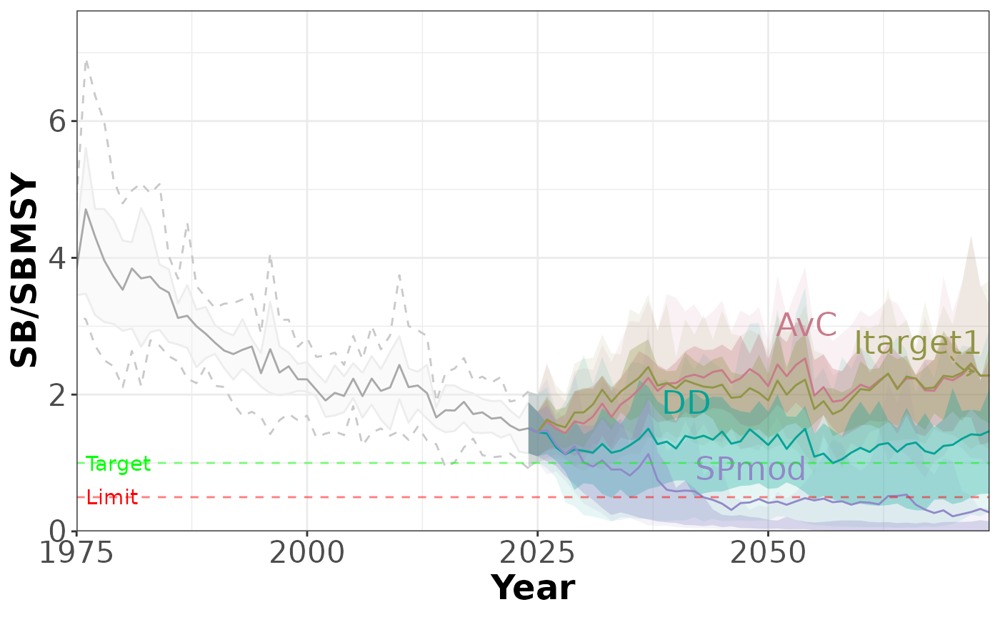

``` r

plotTimeseries(slick, 2, # PI 2, no quantiles
               includeQuants = FALSE)
```

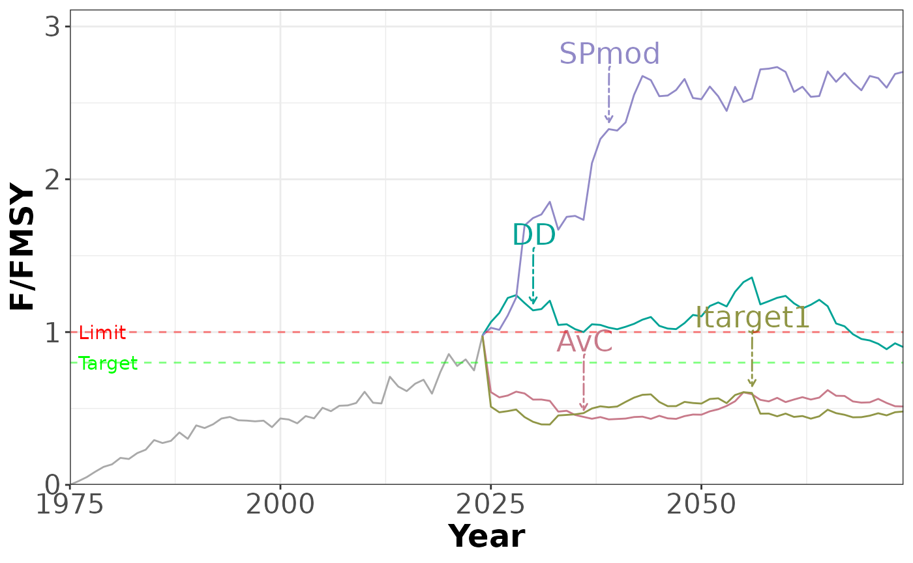

``` r

plotTimeseries(slick,3, # PI 3, no quantiles, no MP labels
               includeQuants = FALSE,
               includeLabels = FALSE)
```

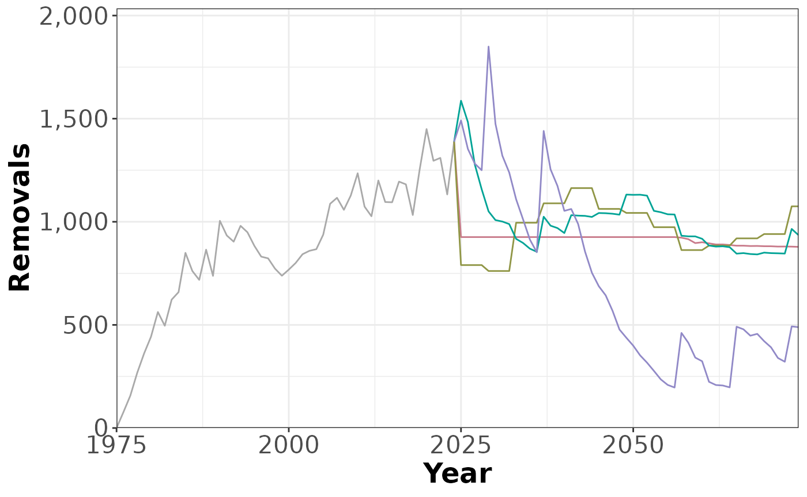

The plot can be faceted by management procedure:

``` r
plotTimeseries(slick, byMP=TRUE)
```

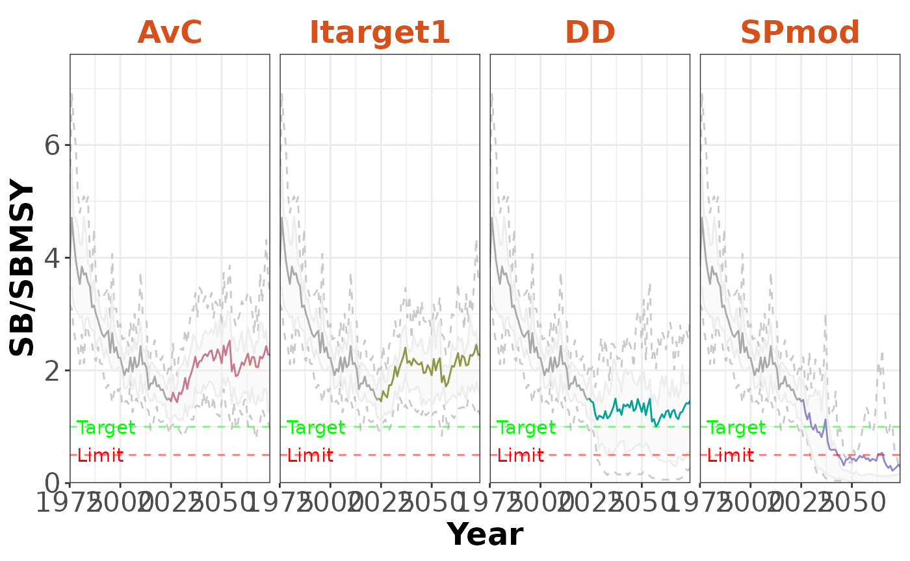

or by operating model:

``` r
plotTimeseries(slick, byOM=TRUE)
```

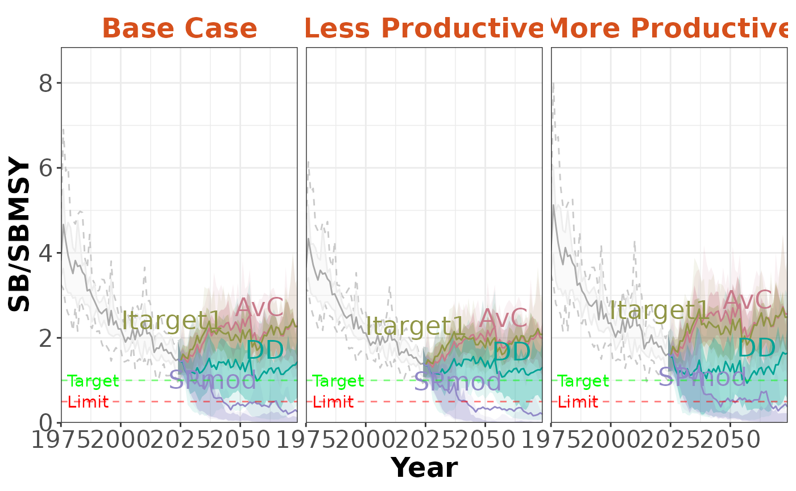

or both:

``` r
plotTimeseries(slick, byOM=TRUE, byMP=TRUE)
```

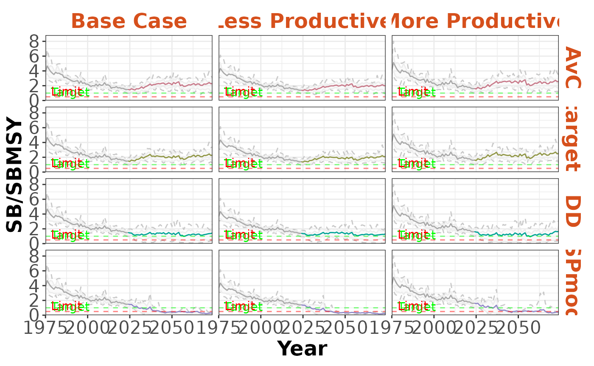

See
[`?plotTimeseries`](https://slick.bluematterscience.com/reference/plotTimeseries.md)
for information on more ways to modify the Time Series plot.

By default, the time series values are calculated as the mean over the
operating models. The `FilterSlick` function can be used to filter the
Slick Object to specific OMs, MPs, or PIs.

Here we are filtering to only include the Base Case OM (OM 1):

``` r
slick_OM1 <- FilterSlick(slick, OMs=1, plot='Timeseries')

plotTimeseries(slick_OM1, byOM=TRUE)
```

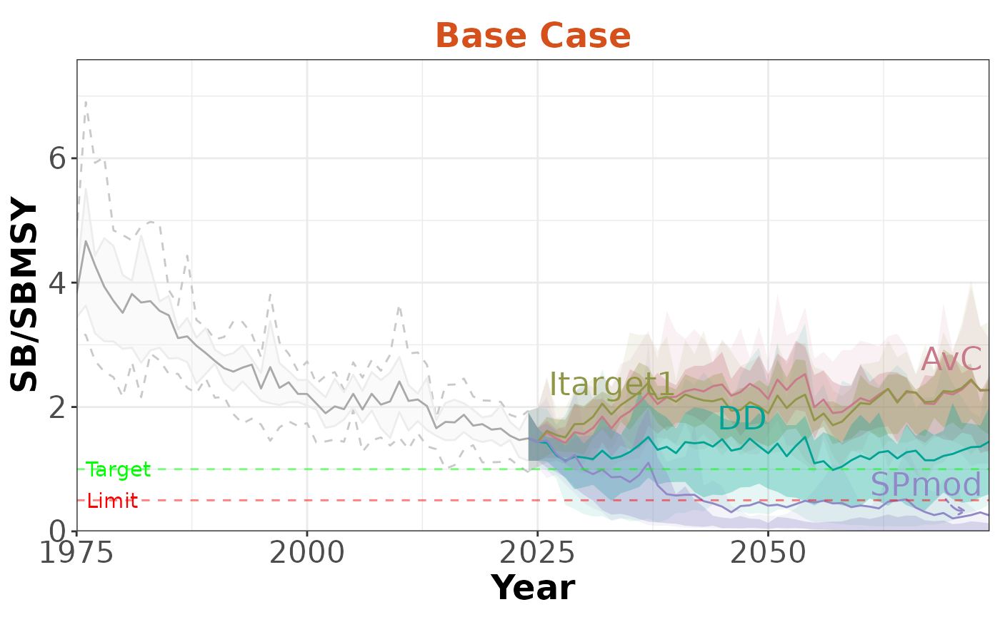

``` r
plotTimeseries(slick_OM1) # same plot
```

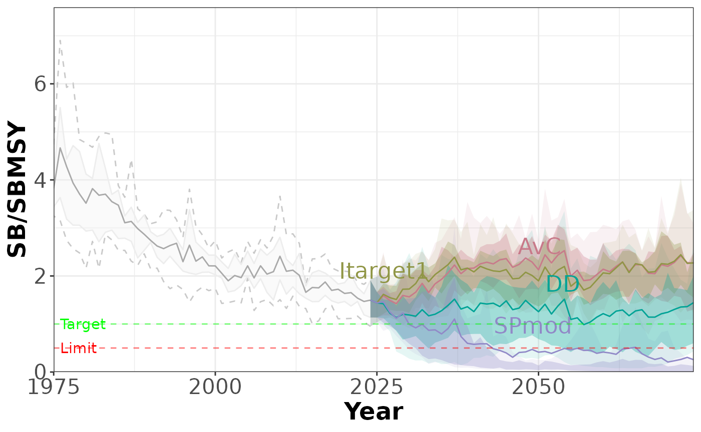

### Checking and Testing

The Slick Object is now complete with the minimum requirements:

1.  A complete `MPs` Object
2.  A complete `OMs` Object
3.  and at least one complete Plot Object (`Timeseries` in this case)

The Slick Object can be checked for completeness with the `Check`
function:

``` r
Check(slick)
#> 
#> ── Checking: "Slick" ──
#> 
#> ── Checking: "MPs"
#> ✔ Complete
#> 
#> ── Checking: "OMs"
#> ✔ Complete
#> 
#> ── Checking: "Boxplot"
#> ℹ Object is empty
#> 
#> ── Checking: "Quilt"
#> ℹ Object is empty
#> 
#> ── Checking: "Kobe"
#> ℹ Object is empty
#> 
#> ── Checking: "Spider"
#> ℹ Object is empty
#> 
#> ── Checking: "Timeseries"
#> ✔ Complete
#> 
#> ── Checking: "Tradeoff"
#> ℹ Object is empty
```

and loaded directly into the `App` as a named argument:

``` r
App(slick=slick)
```

## Boxplot Plot

The documentation for the remaining plots is briefer and assumes you’ve
read the [Time Series Plot](#time-series-plot) section.

Information for the *Boxplot* is stored in a [Boxplot
Object](https://slick.bluematterscience.com/reference/Boxplot-class.md).

A *Boxplot Object* can be created using the `Boxplot` function. Here we
are populating the metadata directly when we create the `Boxplot`
object:

``` r
boxplot <- Boxplot(Code=c('SB/SBMSY 25',
                          'SB/SBMSY 50',
                          'TAC 25'),
                   Label=c('SB/SBMSY Year 25',
                           'SB/SBMSY Year 50',
                           'TAC Year 25'),
                   Description=c('SB/SBMSY in the 25th projection year',
                                 'SB/SBMSY in the last year',
                                 'TAC in the 25th projection year'))
```

`Value` is a numeric array containing the values of the performance
indicators included in the `Boxplot` object. `Value` must have
dimensions `c(nsim, nOM, nMP, nPI)`:

``` r
nOM <- nrow(Design(slick))
nMP <- length(Code(mps))
nPI <- length(Code(boxplot))

Value(boxplot) <- array(NA, dim=c(nsim, nOM, nMP, nPI))

Value(boxplot)[,1,,1] <- MSE_Base@SB_SBMSY[,,25]
Value(boxplot)[,2,,1] <- MSE_LowM@SB_SBMSY[,,25]
Value(boxplot)[,3,,1] <- MSE_HighM@SB_SBMSY[,,25]

Value(boxplot)[,1,,2] <- MSE_Base@SB_SBMSY[,,50]
Value(boxplot)[,2,,2] <- MSE_LowM@SB_SBMSY[,,50]
Value(boxplot)[,3,,2] <- MSE_HighM@SB_SBMSY[,,50]

Value(boxplot)[,1,,3] <- MSE_Base@TAC[,,25]
Value(boxplot)[,2,,3] <- MSE_LowM@TAC[,,25]
Value(boxplot)[,3,,3] <- MSE_HighM@TAC[,,25]
```

Check the `Boxplot` object and add to the Slick Object:

``` r
Check(boxplot)
#> 
#> ── Checking: "Boxplot" ──
#> 
#> ✔ Complete
Boxplot(slick) <- boxplot
```

The `plotBoxplot` function is used to create the Boxplot from a Slick
Object:

``` r
plotBoxplot(slick)
```

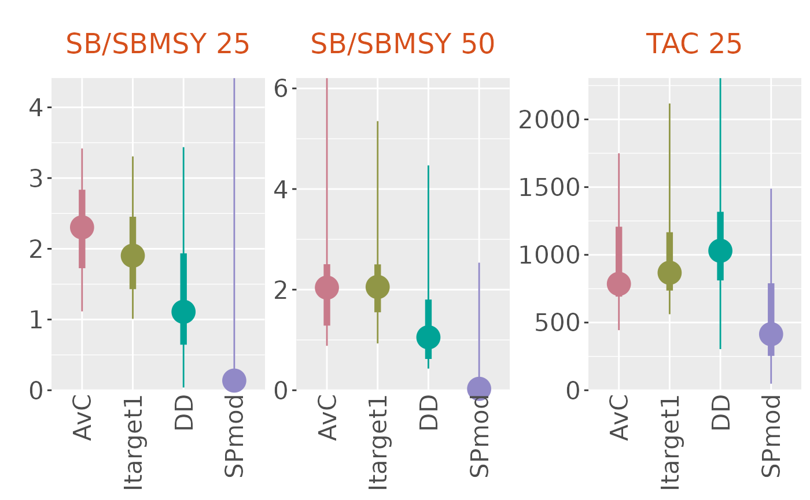

There is an option for violin plots:

``` r
plotBoxplot(slick, type='violin', PI=3)
```

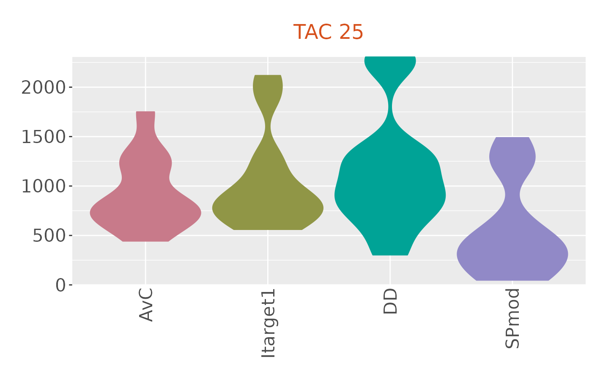

or both types:

``` r
plotBoxplot(slick, type='both')
```

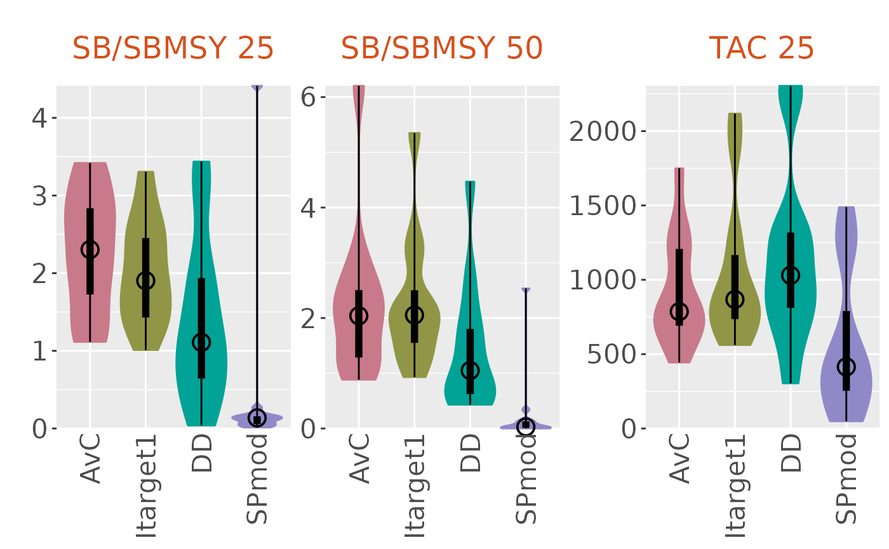

The `byOM=TRUE` argument creates a boxplot for a given performance
indicator for each OM in the Slick Object:

``` r
plotBoxplot(slick, byOM=TRUE)
```

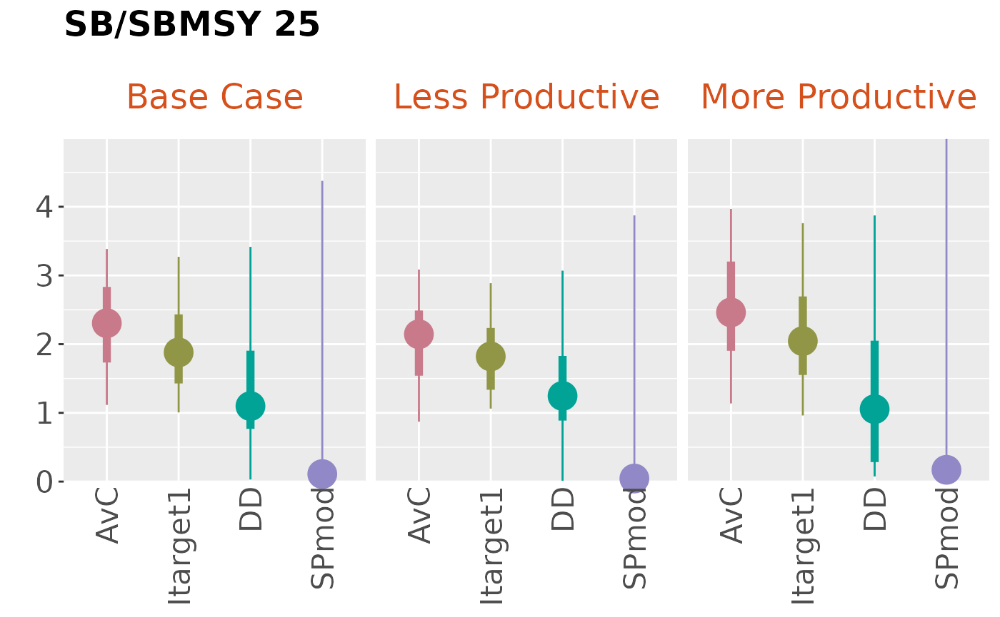

See
[`?plotBoxplot`](https://slick.bluematterscience.com/reference/plotBoxplot.md)
for more options for the `plotBoxplot` function.

The `FilterSlick` can be used to filter the OMs and/or MPs to include in
a given plot:

``` r
plotBoxplot(FilterSlick(slick, MPs=1:3, OMs=1:2, plot='Boxplot'),
            byOM=TRUE)
```

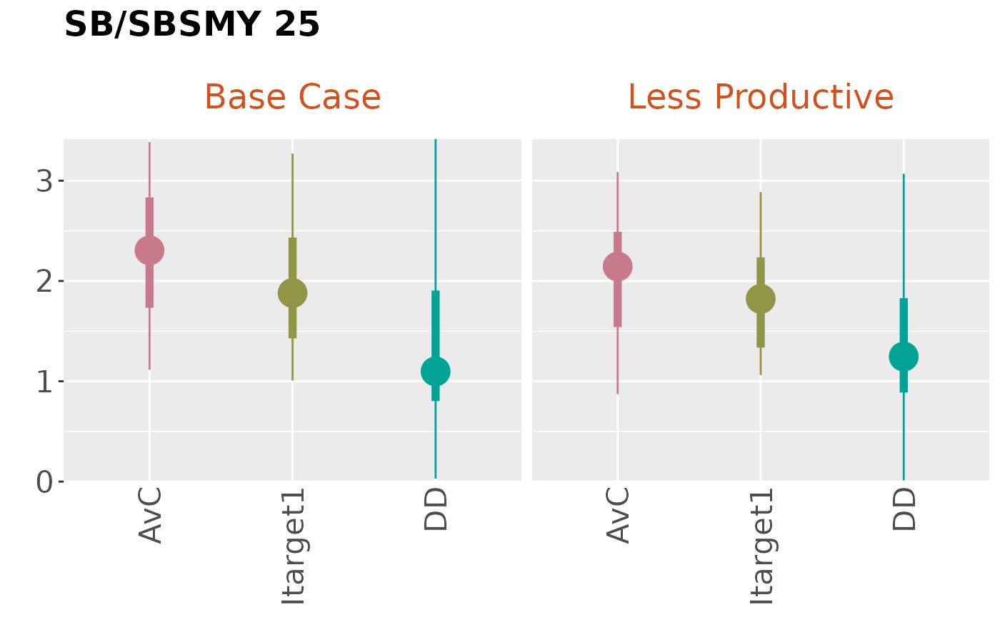

## Kobe Plot

Information for the *Kobe Plot* is stored in a [Kobe
Object](https://slick.bluematterscience.com/reference/Kobe-class.md).

A *Kobe Object* can be created using the `Kobe` function. Here we are
populating the metadata directly when we create the `Kobe` object:

``` r
kobe <- Kobe(Code=c('SB/SBMSY', 'F/FMSY'),
             Label=c('SB/SBMSY', 'F/FMSY'),
             Description = c('Spawning biomass relative to SB_MSY',
                             'Fishing mortality relative to F_MSY')
)
```

The `Time` slot of a Kobe Object contains numeric values for the
projection time-steps:

``` r
Time(kobe) <- seq(2025, by=1, length.out=OM_Base@proyears)
```

`Value` is a numeric array containing the values of the performance
indicators included in the `Kobe` Object. `Value` must have dimensions
`c(nsim, nOM, nMP, nPI, nTS)`:

``` r
nOM <- nrow(Design(slick))
nMP <- length(Code(mps))
nPI <- length(Code(kobe))
nTS <- length(Time(kobe))

Value(kobe) <- array(NA, dim=c(nsim, nOM, nMP, nPI, nTS))

Value(kobe)[,1,,1,] <- MSE_Base@SB_SBMSY
Value(kobe)[,2,,1,] <- MSE_LowM@SB_SBMSY
Value(kobe)[,3,,1,] <- MSE_HighM@SB_SBMSY

Value(kobe)[,1,,2,] <- MSE_Base@F_FMSY
Value(kobe)[,2,,2,] <- MSE_LowM@F_FMSY
Value(kobe)[,3,,2,] <- MSE_HighM@F_FMSY
```

Check and add to the Slick Object:

``` r
Check(kobe)
#> 
#> ── Checking: "Kobe" ──
#> 
#> ✔ Complete
Kobe(slick) <- kobe
```

Plot the Kobe plot:

``` r
plotKobe(slick)
```

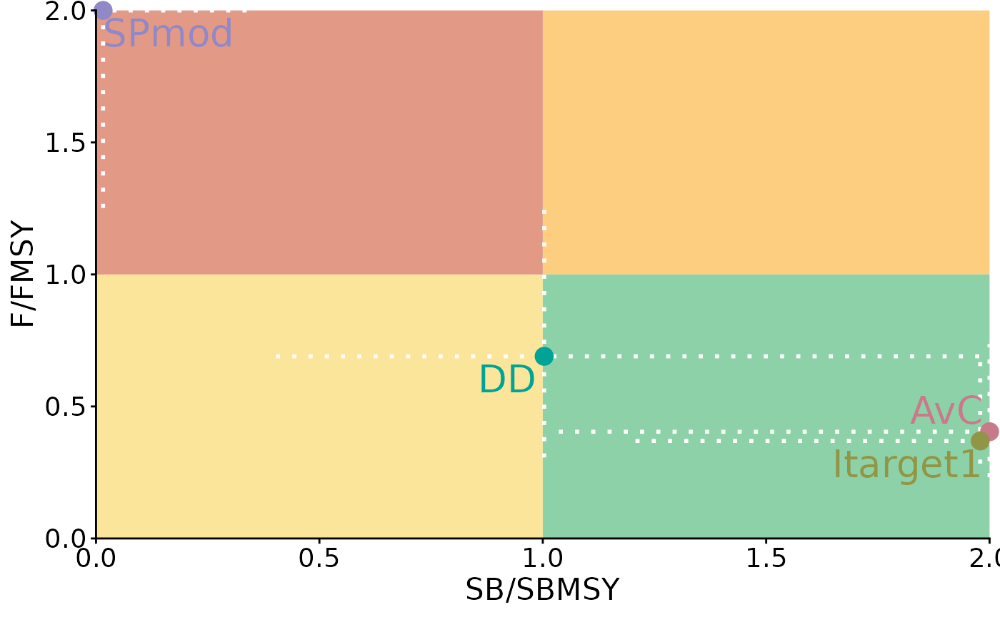

Plot the Kobe Time plot:

``` r
plotKobe(slick, Time=TRUE)
```

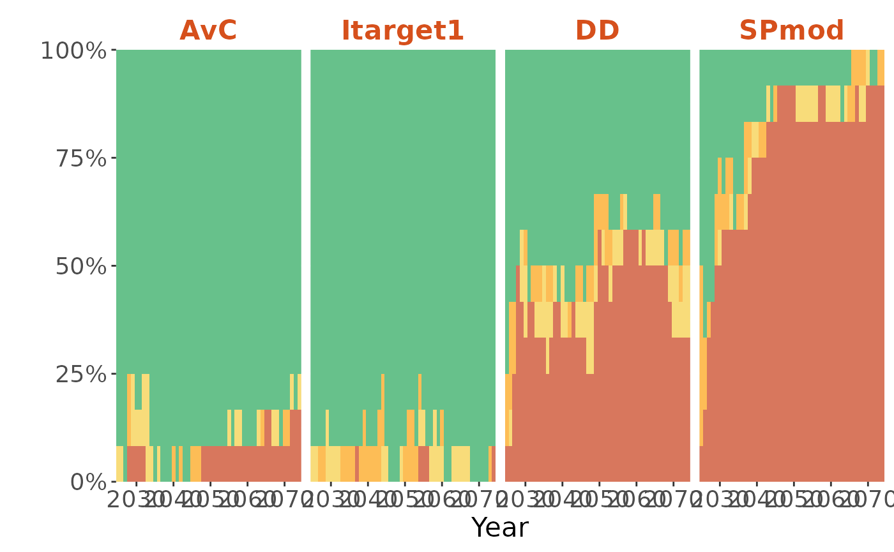

See
[`?plotKobe`](https://slick.bluematterscience.com/reference/plotKobe.md)
for more options for the `plotKobe` function.

## Quilt Plot

Information for the *Quilt Plot* is stored in a [Quilt
Object](https://slick.bluematterscience.com/reference/Quilt-class.md).

A *Quilt Object* can be created using the `Quilt` function. Here we are
populating the metadata directly when we create the `Quilt` object:

``` r
quilt <- Quilt(Code=c('PGK',
                      'P100',
                      'PNOF',
                      'Mean TAC'),
               Label=c('Prob. Green Kobe',
                       'Prob SB>SBMSY',
                       'Prob. Not Overfishing',
                       'Mean Total Allowable Catch'),
               Description = c('Probability of being in the green region of Kobe plot over the projection period',
                               'Probability spawning biomass is greater than SB_MSY over the projection period',
                               'Probability of not overfishing over the projection period',
                               'Mean Total Allowable Catch over the projection period'))
```

`Value` is a numeric array containing the values of the performance
indicators included in the `Quilt` Object. `Value` must have dimensions
`c(nOM, nMP, nPI)` (or optionally dimensions `c(nSim, nOM, nMP, nPI)`):

``` r
nPI <- length(Code(quilt))

Value(quilt) <- array(NA, dim=c(nOM, nMP, nPI))

Value(quilt)[1,,1] <- apply(MSE_Base@SB_SBMSY > 1 & MSE_Base@F_FMSY < 1, 2, mean)
Value(quilt)[2,,1] <- apply(MSE_LowM@SB_SBMSY > 1 & MSE_LowM@F_FMSY < 1, 2, mean)
Value(quilt)[3,,1] <- apply(MSE_HighM@SB_SBMSY > 1 & MSE_HighM@F_FMSY < 1, 2, mean)

Value(quilt)[1,,2] <- apply(MSE_Base@SB_SBMSY > 1, 2, mean)
Value(quilt)[2,,2] <- apply(MSE_LowM@SB_SBMSY > 1, 2, mean)
Value(quilt)[3,,2] <- apply(MSE_HighM@SB_SBMSY > 1, 2, mean)

Value(quilt)[1,,3] <- apply(MSE_Base@F_FMSY < 1, 2, mean)
Value(quilt)[2,,3] <- apply(MSE_LowM@F_FMSY < 1, 2, mean)
Value(quilt)[3,,3] <- apply(MSE_HighM@F_FMSY < 1, 2, mean)

Value(quilt)[1,,4] <- apply(MSE_Base@TAC, 2, mean)
Value(quilt)[2,,4] <- apply(MSE_LowM@TAC, 2, mean)
Value(quilt)[3,,4] <- apply(MSE_HighM@TAC, 2, mean)
```

The `MinValue` and `MaxValue` functions can be used to set minimum and
maximum values for calculating the colored shading for each PI:

``` r
MinValue(quilt) <- c(0,0,0,NA)
MaxValue(quilt) <- c(1,1,1,NA)
```

Check and add to the Slick Object:

``` r
Check(quilt)
#> 
#> ── Checking: "Quilt" ──
#> 
#> ✔ Complete

Quilt(slick) <- quilt
```

The default Quilt plot:

``` r
plotQuilt(slick)
```

Shading scaled between minimum and maximum for each PI:

``` r
plotQuilt(slick, minmax=TRUE)
```

See
[`?plotQuilt`](https://slick.bluematterscience.com/reference/plotQuilt.md)
for more options for the `plotQuilt` function.

## Spider Plot

Information for the *Spider Plot* is stored in a [Spider
Object](https://slick.bluematterscience.com/reference/Spider-class.md).

A *Spider Object* can be created using the `Spider` function. Here we
are populating the metadata directly when we create the `Spider` object:

``` r
spider <- Spider(Code=c('P100',
                      'P50',
                      'PNOF',
                      'Yield'),
               Label=c('Prob SB>SBMSY',
                       'Prob SB>0.5SBMSY',
                       'Prob. Not Overfishing',
                       'Prob. Mean Yield > 50%'),
               Description = c('Probability spawning biomass is greater than SB_MSY over the projection period',
                               'Probability spawning biomass is greater than 0.5 SB_MSY over the projection period',
                               'Probability of not overfishing over the projection period',
                               'Probability mean yield is greater than 50% of the reference yield'))
```

`Value` is a numeric array containing the values of the performance
indicators included in the `Spider` Object. `Value` must have dimensions
`c(nOM, nMP, nPI)`:

``` r
nPI <- length(Code(spider))

Value(spider) <- array(NA, dim=c(nOM, nMP, nPI))

Value(spider)[1,,1] <- MSEtool::P100(MSE_Base)@Mean
Value(spider)[2,,1] <- MSEtool::P100(MSE_LowM)@Mean
Value(spider)[3,,1] <- MSEtool::P100(MSE_HighM)@Mean

Value(spider)[1,,2] <- MSEtool::P50(MSE_Base)@Mean
Value(spider)[2,,2] <- MSEtool::P50(MSE_LowM)@Mean
Value(spider)[3,,2] <- MSEtool::P50(MSE_HighM)@Mean

Value(spider)[1,,3] <- MSEtool::PNOF(MSE_Base)@Mean
Value(spider)[2,,3] <- MSEtool::PNOF(MSE_LowM)@Mean
Value(spider)[3,,3] <- MSEtool::PNOF(MSE_HighM)@Mean

Value(spider)[1,,4] <- MSEtool::LTY(MSE_Base)@Mean
Value(spider)[2,,4] <- MSEtool::LTY(MSE_LowM)@Mean
Value(spider)[3,,4] <- MSEtool::LTY(MSE_HighM)@Mean
```

There are a few things to consider for the `Value` of the Spider plot:

1.  The values for each Performance Indicator must be on the same scale,
    with high values indicating better performance
2.  Values cannot be negative
3.  All values should be between 0 and 1, or between 0 and 100, with 1
    or 100 representing the highest possible value for a Performance
    Indicator.

Check and add to the Slick Object:

``` r
Check(spider)
#> 
#> ── Checking: "Spider" ──
#> 
#> ✔ Complete

Spider(slick) <- spider
```

The default Spider Plot:

``` r
plotSpider(slick)
```

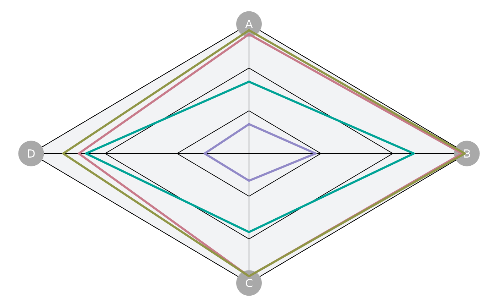

Option to include fill color:

``` r
plotSpider(slick, fill=TRUE)
```

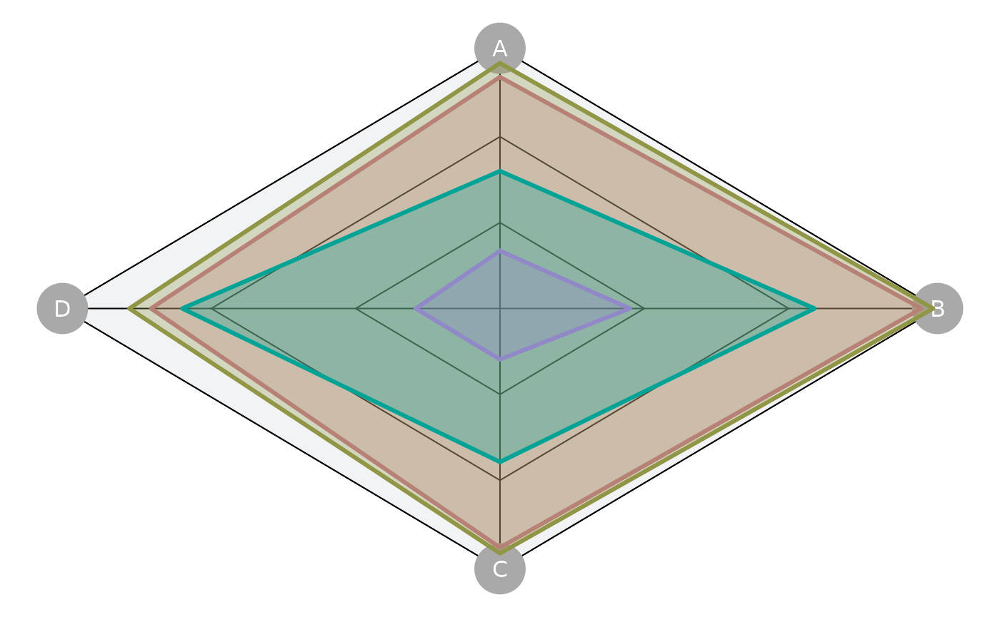

Plot by MP:

``` r
plotSpider(slick, byMP=TRUE)
```

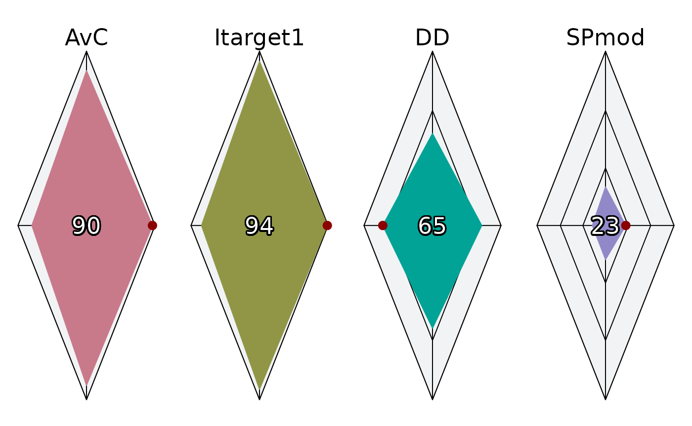

Or by OM and MP:

``` r
plotSpider(slick, byOM=TRUE, incMean = FALSE)
```

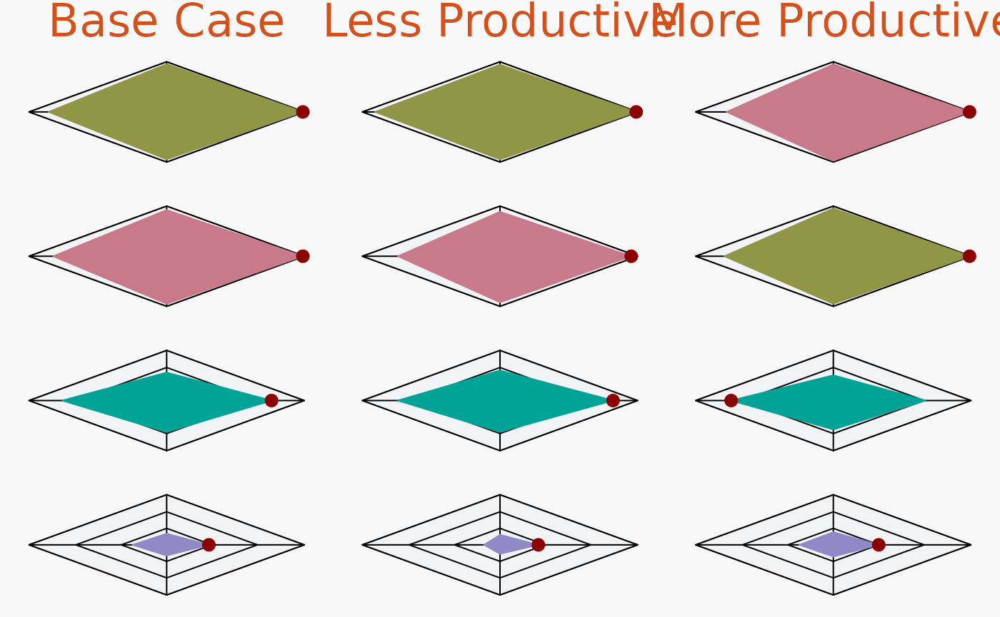

See
[`?plotSpider`](https://slick.bluematterscience.com/reference/plotSpider.md)
for more options for the `plotSpider` function.

## Tradeoff Plot

Information for the *Tradeoff Plot* is stored in a [Tradeoff
Object](https://slick.bluematterscience.com/reference/Tradeoff-class.md).

A *Tradeoff Object* can be created using the `Tradeoff` function. Here
we are populating the metadata directly when we create the `Tradeoff`
object:

``` r
tradeoff <- Tradeoff(Code=c('P100',
                        'P50',
                        'PNOF',
                        'Yield'),
                 Label=c('Prob SB>SBMSY',
                         'Prob SB>0.5SBMSY',
                         'Prob. Not Overfishing',
                         'Prob. Mean Yield > 50%'),
                 Description = c('Probability spawning biomass is greater than SB_MSY over the projection period',
                                 'Probability spawning biomass is greater than 0.5 SB_MSY over the projection period',
                                 'Probability of not overfishing over the projection period',
                                 'Probability mean yield is greater than 50% of the reference yield'))
```

Here we are using the same Performance Indicators as those in the Spider
Plot.

`Value` is a numeric array containing the values of the performance
indicators included in the `Tradeoff` Object. `Value` must have
dimensions `c(nOM, nMP, nPI)`:

``` r
nPI <- length(Code(tradeoff))

Value(tradeoff) <- array(NA, dim=c(nOM, nMP, nPI))

Value(tradeoff)[1,,1] <- MSEtool::P100(MSE_Base)@Mean
Value(tradeoff)[2,,1] <- MSEtool::P100(MSE_LowM)@Mean
Value(tradeoff)[3,,1] <- MSEtool::P100(MSE_HighM)@Mean

Value(tradeoff)[1,,2] <- MSEtool::P50(MSE_Base)@Mean
Value(tradeoff)[2,,2] <- MSEtool::P50(MSE_LowM)@Mean
Value(tradeoff)[3,,2] <- MSEtool::P50(MSE_HighM)@Mean

Value(tradeoff)[1,,3] <- MSEtool::PNOF(MSE_Base)@Mean
Value(tradeoff)[2,,3] <- MSEtool::PNOF(MSE_LowM)@Mean
Value(tradeoff)[3,,3] <- MSEtool::PNOF(MSE_HighM)@Mean

Value(tradeoff)[1,,4] <- MSEtool::LTY(MSE_Base)@Mean
Value(tradeoff)[2,,4] <- MSEtool::LTY(MSE_LowM)@Mean
Value(tradeoff)[3,,4] <- MSEtool::LTY(MSE_HighM)@Mean
```

Check and add to the Slick Object:

``` r
Check(tradeoff)
#> 
#> ── Checking: "Tradeoff" ──
#> 
#> ✔ Complete

Tradeoff(slick) <- tradeoff
```

The default Tradeoff Plot:

``` r
plotTradeoff(slick)
```

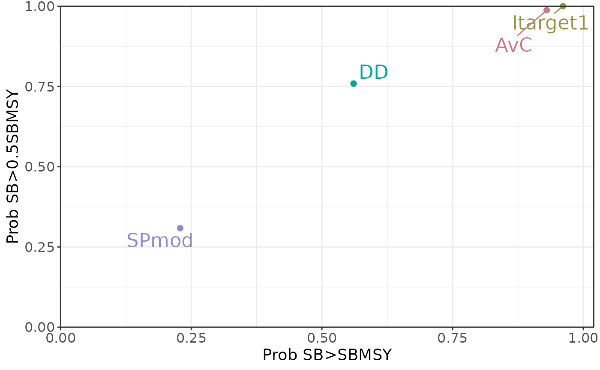

Tradeoff Plot with multiple Performance Indicators:

``` r
plotTradeoff(slick, 1:2, 3:4)
```

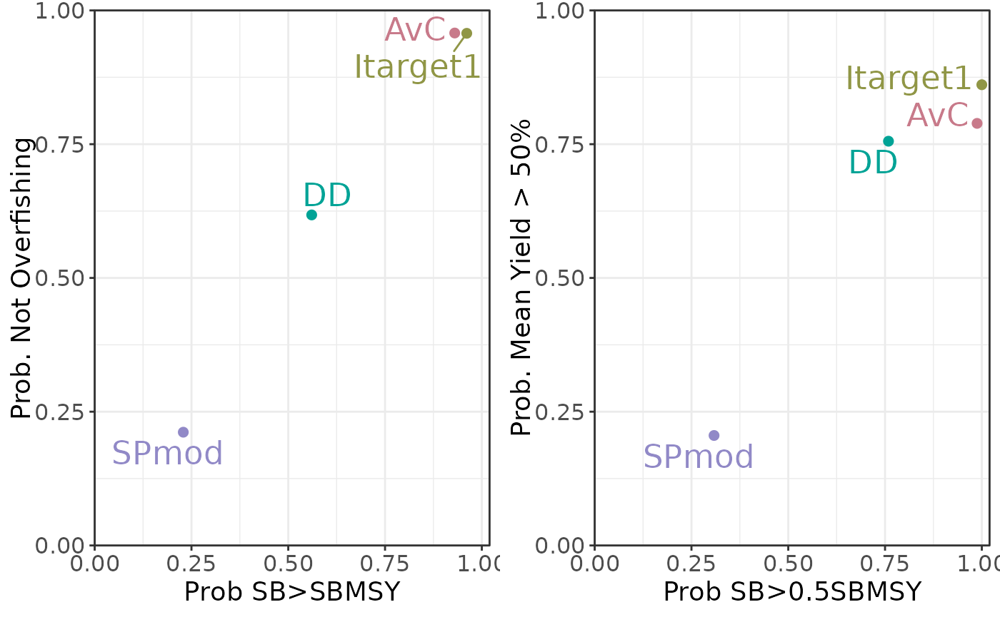

See
[`?plotTradeoff`](https://slick.bluematterscience.com/reference/plotTradeoff.md)
for more options for the `plotTradeoff` function.

## Slick Object Library

You can add your Slick object to the list of case studies that can be
directly loaded from the [App](#app) by adding your Slick Object to the
[SlickLibrary repository](https://github.com/Blue-Matter/SlickLibrary).

This can be helpful if you wish to share your MSE results with others
(e.g., a working group or stakeholders), as otherwise you will need to
share the Slick Object file directly with them via email or some other
method, and they will have to upload the file into the App.

This method also allows you to update the Slick Object easily.

The way to do this is to clone the *SlickLibrary* repository, than save
your Slick Object to the *Slick_Objects* directory, and submit a pull
request so that your change can be incorporated into the *SlickLibrary*
repo.

A couple of things to note:

1.  The Slick Object must be saved with `saveRDS` with extension
    `.slick`
2.  The file name should be the name with wish to be displayed in the
    Case Study selection menu, with an underscore “\_” to separate
    words.

``` r
saveRDS(slick, '../SlickLibrary/Slick_Objects/Example.slick')
```

Your Slick object will be available immediately once the *SlickLibrary*
repository is updated.
